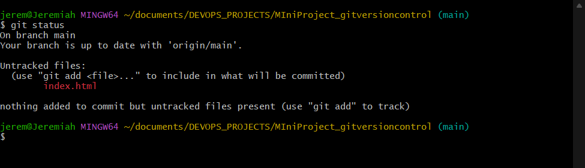
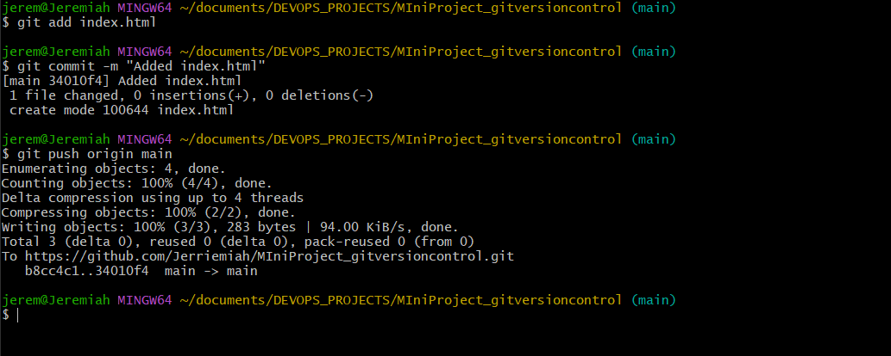

# MIniProject_gitversioncontrol
This project demonstrates Git commands execution with a valid terminal screenshot showing their outputs. 

## Repository LInk
[MiniProject GitHub Repository](https://github.com/Jerriemiah/MIniProject_gitversioncontrol.git)

## Screenshots
### Git Status output

### Git Add Output
